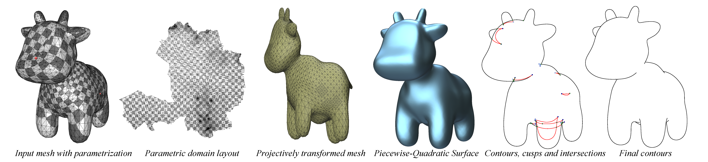

# Algebraic Smooth Occluding Contours

<strong>Ryan Capouellez<sup>1</sup>, Jiacheng Dai<sup>1</sup>, Aaron Hertzmann<sup>2</sup>, Denis Zorin<sup>1</sup></strong>

<small><sup>1</sup>New York University, <sup>2</sup>Adobe Research</small>

Implementation of [Algebraic Smooth Occluding Contours](http://ryanjcapouellez.com/papers/algebraic_smooth_occluding_contours.html).



This algorithm takes an input mesh and camera viewpoint, approximates the mesh with a smooth piecewise-quadratic surface, and computes the occluding contours of this approximating surface in closed form. These contours are piecewise-rational curves in image-space, and they are computed with consistent visibility much more efficiently than previous methods.

## Installation

To install this project on a Unix-based system, use the following standard CMake build procedure:

```bash
git clone https://github.com/rjc8237/algebraic-contours.git
cd algebraic-contours
mkdir build
cd build
cmake -DCMAKE_BUILD_TYPE=Release ..
make -j 8
```

## Usage

The core contour generation pipeline is `bin/generate_algebraic_contours`. This executable takes the following arguments:

|flag | description|
| --- | --- |
|`-i`, `--input` | Mesh filepath|
|`-o`, `--output` | Output directory|
|`-c`, `--camera` | Camera filepath (uses default camera if none provided)|
|`--log_level` | Level of logging|
|`--invisibility_method` | Method for invisibility tests of contours|
|`--svg_mode` | Output mode for SVG contours|
|`-w`, `--weight` | Fitting weight for the quadratic surface approximation|
|`--trim` | Trimming for contour intersection checks|
|`--pad` | Padding for contour chaining checks|
|`--show_nodes` | Show important nodes in the contours|

Supported parameter values for `log_level`, `invisibility_method`, and `svg_mode` are listed by `bin/generate_algebraic_contours --help`.

The input mesh must be a manifold surface with texture coordinates describing a parameterization with isolated cone vertices; such a parameterization can be generated using the method of [Efficient and Robust Discrete Conformal Equivalence with Boundary](https://github.com/geometryprocessing/ConformalIdealDelaunay). The camera file must be a comma separated 4 by 4 projective transformation matrix.

We also include a viewer executable `bin/view_quadratic_spline` for the piecewise-quadratic spline approximation, which supports the following arguments:

|flag | description|
| --- | --- |
|`-i`, `--input` | Mesh filepath|
|`--log_level` | Level of logging|
|`-w`, `--weight` | Fitting weight for the quadratic surface approximation|
|`--num_subdivisions` | Number of subdivisions for triangulation|

## Figure Reproduction

Scripts to generate the figures of Algebraic Smooth Occluding Contours are included in `figures`.


The models (with parameterizations) and cameras used in [Algebraic Smooth Occluding Contours](http://ryanjcapouellez.com/papers/algebraic_smooth_occluding_contours.html) necessary for these scripts can be downloaded [here](http://ryanjcapouellez.com/papers/algebraic-contours-data.zip); they must be copied to `data/meshes` and `data/cameras` respectively.

The figure scripts can be run independently or in batch with the command
```
bash fig-all.sh
```

We also provide scripts to generate animation frames for the supplementary videos. These can be run with the commands
```
bash anim-rotation.sh
bash anim-approximation-error.sh
```

## Citation

```
@inproceedings{capouellez:2023:algebraic,
  author = {Capouellez, Ryan and Dai, Jiacheng and Hertzmann, Aaron and Zorin, Denis},
  title = {Algebraic Smooth Occluding Contours},
  year = {2023},
  isbn = {9798400701597},
  publisher = {Association for Computing Machinery},
  address = {New York, NY, USA},
  url = {https://doi.org/10.1145/3588432.3591547},
  doi = {10.1145/3588432.3591547},
  booktitle = {ACM SIGGRAPH 2023 Conference Proceedings},
  articleno = {39},
  numpages = {10},
  keywords = {non-photorealistic rendering, contours, visibility, piecewise-quadratic surface},
  location = {Los Angeles, CA, USA},
  series = {SIGGRAPH '23}
}
```
